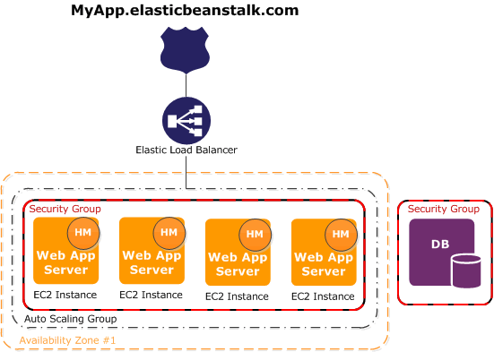

# happy-birthday-flask
Simple flask app for birthday wishes! It checks for valid username input (only letters) and for duplicates and returns birthday wishes!


### Endpoints
Following are the endpoints are implemented

| Name   | Method      | URL
| ---    | ---         | ---
| List   | `GET`       | `/hello`
| Create | `POST`      | `/hello/{name`
| Get    | `GET`       | `/hello/{name}`
| Update | `PUT/PATCH` | `/hello/{name}`

# Usage

**To run e2e and unit test:**
```sh
pipenv install; pipenv run pytest tests
```

**To launch in docker:**
```sh
export SERVE_PORT=9000
export ENVIRONMENT=development
./docker_launch.sh
```


##### Production Deployment Option 1


I wasn't sure if this was the expected route for a production deployment. But to avoid to too much overhead for one person, I think elastic beanstalk would be a perfectly valid method of deploying this as a stand alone application, backed by RDS (postgres). I personally wouldn't containerize this if this application would be standalone to avoid additional complexity.

##### Production Deployment Option 2


This is another option, using a combination of ECR, ECS, and fargate. I would go with this method if this API would live in a cluster amongst other services. This solution would be more practical for a company that needs to support numerous services.


### Final Thoughts
I personally did not have time to implement a production deployment of this application, but I would have used terraform to do so and most likely used elastic beanstalk (still not sure if thats what was expected, I was told not to take shortcuts?). However, I feel the need to comment how extensive this test was. I was confused as to what expectations production deployment may entail. Should I expect things like CI/CD implementations to be inplace, security, monitoring etc. This test could go in multiple directions and consume far too much time to implement, in my opinion. Thank you for the opportunity and please excuse my time constraints and inability complete this last bit.